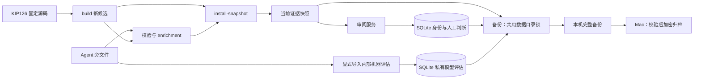

# 存储职责与生命周期

运行服务保留一个 SQLite 和一份当前证据快照。源码与 Agent 旁文件是可重建输入，
人工身份和判断是持久业务数据；应用制品不携带任何运行数据。

| 数据 | 权威位置 | 生命周期 |
| --- | --- | --- |
| Lean 源码、自然语言、回译和标签 | 校验过的 `snapshot.json` | 构建新候选，显式安装切换 |
| 姓名、角色、恢复摘要、草稿、人工判断和历史 | `judgments.sqlite3` | 事务写入、编号迁移、在线备份 |
| 机器预期判断、两个原始置信度及运行历史 | 同库的独立 `agent_assessment_runs` / `agent_assessments` | 显式导入、版本绑定、保留历史；不进入审阅接口 |
| 会话、验证码、限流和预览恢复凭证 | 同库的认证表 | 可丢弃；恢复备份后重新登录 |
| 本机认证密钥 | `auth-pepper` | 私有运行文件，不进入备份或发布包 |
| 备份 | 时间戳目录中的数据库、快照和清单 | 验证完成后发布，按明确范围保留 |



## 数据库

`database.py` 管理全部表、索引、连接和迁移。已发布迁移不修改，schema 7
统一认证表，并把会话与预览恢复凭证中的 owner 列从 `email` 改为 `reviewer`。
邮箱验证码表仍使用 `email`。schema 8 新增 `review_drafts`，schema 9 新增
`agent_assessment_runs` 和 `agent_assessments`，均不重写或清理已有人工历史。
schema 10 增加数据集作用域、草稿隔离和单数据集管理员授权；旧 KIP126 记录以可重试的副本接入新作用域，原记录保留供快照回退。细节见 [多仓库与版本](REPOSITORIES.md)。
schema 11 为显式跨版本沿用的人工判断记录来源数据集和原始记录 ID，原始作者、时间、提交和证据摘要保留；安装在维护锁内核对前身快照，再复制当前有效判断，重复安装不增加副本。
迁移保留身份、角色、恢复摘要、判断、草稿和已有会话；升级前的应用不支持 schema 11，
升级前先备份并停止本服务，再用新代码迁移。
迁移失败保持服务停用；回滚必须使用兼容版本或已验证的迁移前备份。

`SessionStore` 管理签发、验证、缓存和退出，姓名、邮箱和预览各自处理凭证。
姓名身份不继承发邮件逻辑。`session_email` 保留为旧调用适配器，返回值仍是
内部身份；新调用使用 `session_reviewer`。

草稿按数据集、审阅者、条目 ID 和内容指纹保留一份，通过版本校验更新。完成后保留版本检查点，
拒绝迟到请求覆盖较新输入；未完成草稿不参与进度、管理汇总或正式结果导出。
备注未选结论时也可保存草稿。完成审阅或离开条目时，先保存草稿再生成正式判断，
无内容变化不追加历史；每次请求重试使用原请求 ID。旧版本草稿不迁移到变化的内容，
数据库备份同时保留草稿。

姓名只用于显示，同名者不合并。正式人工判断追加保存，每条记录绑定条目 ID、
内容指纹、源码提交和快照 digest。当前结论从匹配当前内容的历史中选取最新记录，
不会把修改后的源码自动继承为通过。SQLite 保持 WAL、短事务和单服务实例写入。

## 私有模型评估

`statement-enrichment.v2` 的预期判断、理由、判断置信度及原始回译置信度只通过
`import-agent-assessments` 写入 SQLite。`build`、`validate-enrichment` 和
`enrich-snapshot` 不创建或写入数据库。候选快照不携带预期判断，审阅卡片、初始卡片、
目录接口和审阅者导出也不读取这两张内部表；模型评估不计入人工审阅状态或进度。

先将目标服务升级到支持当前 schema 11 的应用、备份并停服后执行编号迁移；不要用开发版
导入器直接升级仍运行旧应用的线上数据库。首次向新的私有数据目录导入也会通过
`initialize` 应用编号迁移，但不会安装快照或创建用户。以下命令是显式数据库写入：

```sh
python3 -m review_app import-agent-assessments \
  --snapshot /path/to/original-frozen-base/snapshot.json \
  --file /path/to/run/collected/enrichment.json \
  --data-dir /path/to/review-data
```

`--snapshot` 必须是本批次使用的原始冻结基础快照，不能换成补充回译后的候选快照。
允许先导入内部结果、再安装候选；该命令不要求目标目录当前快照与基础快照相同，
也不会切换当前快照。完整输入通过来源和字段校验后才取得共用数据目录锁并开始维护。

运行表保存实际模型、推理等级、时间、规则版本、源码提交、基础快照、预期上下文
digest 和主题配置。每条结果绑定精确声明和 Lean 源码 SHA-256，保留原始 worker JSON、
最终结果、原始与最终回译哈希，以及主 Agent 复核元数据。两个自报分值和机器预期判断
始终保存原始值；复核不把机器判断变为人工结论。

同一 `run_id` 的运行记录和 `(run_id, declaration_id)` 的结果不可覆盖；精确重试不追加，
内容冲突整批回滚。新源码、预期说明或重新运行使用新的批次 ID，保留历史便于在相同
版本和预期口径下进行内部评估。数据库在线备份自动包含这两张持久表，只有临时认证表
会被清空，因此异机加密备份与恢复一并保留内部结果。

## 证据

`build --output <新文件>` 和 `enrich-snapshot --output <新文件>` 都只产候选。
候选发布采用排他写入并同步到磁盘，已有输出、运行数据和被审源码目录不能覆盖。
兼容的 `build --data-dir` 仅允许空候选目录，不是升级入口。

`install-snapshot` 是运行证据的唯一切换入口：验证候选，取得数据目录锁，
读取旧证据、为旧判断补齐稳定内容依据，再原子切换快照。`migrate` 也使用此锁。
服务在启动时加载快照，证据更新后仍需重启服务。

## 备份

备份与快照安装使用同一个 `.data.lock`，同时协调线程和进程。备份使用 SQLite
在线 API；快照只读一次，该副本同时用于写文件和生成 manifest。数据库副本
清除临时认证状态并生成新的 SQLite 文件，检查完整性；v2 清单记录源数据目录、
数据库与快照的大小和 SHA-256。全部完成后才发布备份目录。

命令行 `backup` 默认不清理历史；`--keep N` 显式启用数量保留。每日 helper
默认 `REVIEW_BACKUP_KEEP=30`，systemd 从 `/etc/formaliscope/backup.env` 读取配置，
模板在 `deploy/backup.env.example`。只能在新备份成功后清理同一源数据目录的
已验证 v2 完整备份，保留最新文件。旧 v1、损坏或未知目录、临时目录、符号链接
及其他源数据目录的备份不自动删除。

每份完整备份独立携带对应快照，便于移机恢复。当前阶段以明确保留数量控制容量，
快照不拆成另一个外部依赖存储。

## 异机交付与恢复

第一版异机目的地是用户的 Mac，存放在应用项目的 `.formaliscope/backups/hk-vps/`。
独立同步工具只读取服务器已完成的 v2 时间戳备份，经过 SSH 拉取、摘要与完整性
校验后加密归档，并实际解密复验。密钥单独保存在 `.formaliscope/backups/keys/`，
本机路径配置、密钥和归档都不进入 Git 或发布包。工具不读取活动数据库、会话、
`auth-pepper` 或明文恢复码，也不改 VPS 的运行证据和用户数据。

仅在本轮成功后保留最近 30 份本任务可解密验证且来源匹配的归档；损坏、未知或
符号链接文件不自动删除。重复拉取校验已有归档而不覆盖。具体配置、定时运行及
恢复见 [本机异机备份](OFFSITE_BACKUP.md)。

迁移或恢复前先保留当前数据，停止目标服务，在新的空目录恢复数据库和对应快照，
设置服务账号、目录 0700 和文件 0600。校验清单、文件摘要与 SQLite 完整性，
再运行兼容的迁移、预检和登录验证。恢复时生成新的本机密钥；原恢复码仍有效，
旧会话失效。至少完成一次隔离恢复演练后再制定异机保留策略。

v2 备份在传输前和异机解密后使用只读验证入口：

```bash
python3 -m review_app verify-backup --directory /path/to/completed-backup
```

命令验证文件摘要、大小、快照来源与数据库完整性，不依赖原数据目录。
旧 v1 按部署文档手动核对和恢复，不自动清理。

部署步骤见 [DEPLOYMENT.md](DEPLOYMENT.md)，应用、数据库与证据版本线见
[VERSIONING_AND_RELEASE.md](VERSIONING_AND_RELEASE.md)。
