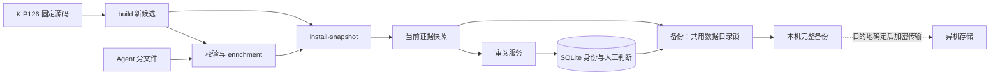

# 存储职责与生命周期

运行服务保留一个 SQLite 和一份当前证据快照。源码与 Agent 旁文件是可重建输入，
人工身份和判断是持久业务数据；应用制品不携带任何运行数据。

| 数据 | 权威位置 | 生命周期 |
| --- | --- | --- |
| Lean 源码、自然语言、回译和标签 | 校验过的 `snapshot.json` | 构建新候选，显式安装切换 |
| 姓名、角色、恢复摘要、人工判断和历史 | `judgments.sqlite3` | 事务写入、编号迁移、在线备份 |
| 会话、验证码、限流和预览恢复凭证 | 同库的认证表 | 可丢弃；恢复备份后重新登录 |
| 本机认证密钥 | `auth-pepper` | 私有运行文件，不进入备份或发布包 |
| 备份 | 时间戳目录中的数据库、快照和清单 | 验证完成后发布，按明确范围保留 |



## 数据库

`database.py` 管理全部表、索引、连接和迁移。已发布迁移不修改，新增 schema 7
统一认证表，并把会话与预览恢复凭证中的 owner 列从 `email` 改为 `reviewer`。
邮箱验证码表仍使用 `email`。迁移保留身份、角色、恢复摘要、判断和已有会话；
旧应用不支持 schema 7，升级前先备份并停止本服务，再用新代码迁移。
迁移失败保持服务停用；回滚必须使用兼容版本或已验证的迁移前备份。

`SessionStore` 管理签发、验证、缓存和退出，姓名、邮箱和预览各自处理凭证。
姓名身份不继承发邮件逻辑。`session_email` 保留为旧调用适配器，返回值仍是
内部身份；新调用使用 `session_reviewer`。

姓名只用于显示，同名者不合并。人工判断追加保存，每条记录绑定条目 ID、
内容指纹、源码提交和快照 digest。当前结论从匹配当前内容的历史中选取最新记录，
不会把修改后的源码自动继承为通过。SQLite 保持 WAL、短事务和单服务实例写入。

## 证据

`build --output <新文件>` 和 `enrich-snapshot --output <新文件>` 都只产候选。
候选发布采用排他写入并同步到磁盘，已有输出、运行数据和被审源码目录不能覆盖。
兼容的 `build --data-dir` 仅允许空候选目录，不是升级入口。

`install-snapshot` 是运行证据的唯一切换入口：验证候选，取得数据目录锁，
读取旧证据、为旧判断补齐稳定内容依据，再原子切换快照。`migrate` 也使用此锁。
服务在启动时加载快照，证据更新后仍需重启服务。

## 备份

备份与快照安装使用同一个 `.data.lock`，同时协调线程和进程。备份使用 SQLite
在线 API；快照只读一次，该副本同时用于写文件和生成 manifest。数据库副本
清除临时认证状态并生成新的 SQLite 文件，检查完整性；v2 清单记录源数据目录、
数据库与快照的大小和 SHA-256。全部完成后才发布备份目录。

命令行 `backup` 默认不清理历史；`--keep N` 显式启用数量保留。每日 helper
默认 `REVIEW_BACKUP_KEEP=30`，systemd 从 `/etc/formaliscope/backup.env` 读取配置，
模板在 `deploy/backup.env.example`。只能在新备份成功后清理同一源数据目录的
已验证 v2 完整备份，保留最新文件。旧 v1、损坏或未知目录、临时目录、符号链接
及其他源数据目录的备份不自动删除。

每份完整备份独立携带对应快照，便于移机恢复。当前阶段以明确保留数量控制容量，
快照不拆成另一个外部依赖存储。

## 异机交付与恢复

异机目的地待确定，本次只准备完整备份和配置，不启用外部传输。
后续传输任务读取已完成的时间戳目录，用单独管理的密钥加密，复制到指定服务器
或对象存储，再校验远端摘要。异机任务不读取活动数据库、会话、`auth-pepper`
或明文恢复码，不在 Git 或环境模板中保存凭据。

迁移或恢复前先保留当前数据，停止目标服务，在新的空目录恢复数据库和对应快照，
设置服务账号、目录 0700 和文件 0600。校验清单、文件摘要与 SQLite 完整性，
再运行兼容的迁移、预检和登录验证。恢复时生成新的本机密钥；原恢复码仍有效，
旧会话失效。至少完成一次隔离恢复演练后再制定异机保留策略。

v2 备份在传输前和异机解密后使用只读验证入口：

```bash
python3 -m review_app verify-backup --directory /path/to/completed-backup
```

命令验证文件摘要、大小、快照来源与数据库完整性，不依赖原数据目录。
旧 v1 按部署文档手动核对和恢复，不自动清理。

部署步骤见 [DEPLOYMENT.md](DEPLOYMENT.md)，应用、数据库与证据版本线见
[VERSIONING_AND_RELEASE.md](VERSIONING_AND_RELEASE.md)。
