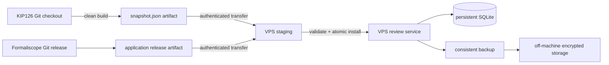

# 版本、兼容性与发布模型

审核系统同时管理三条独立的版本线，部署和数据判断不能只看某一个 Git commit。

| 版本线 | 标识 | 作用 |
|---|---|---|
| 审核应用 | `Formaliscope` vX.Y.Z release + Git commit | 前后端功能与支持的格式 |
| 数据库 | `schema_migrations.version` | 持久判断的表结构 |
| 被审内容 | `source_commit` + `snapshot.digest` + `fingerprint_scheme` | 本次展示的 NL/Lean 证据 |

当前代码的数据库 schema 为 8；当前快照格式为 `kip126-review-snapshot.v2`，同时兼容读取 v1；当前审核依据算法为 `kip126-review-content.v1`。schema 5 新增显示姓名表，6 新增姓名身份与恢复摘要，7 将全部认证表纳入统一迁移，并把会话与预览凭证的身份列统一为 `reviewer`，保留已有数据。schema 8 增加独立草稿表，自动保存不再追加历史，既有历史逐条保留。手动 Agent 旁文件为 `statement-enrichment.v1`，具体数学正文变化仍沿用内容指纹规则；中文展示别名和标签不改原标题/陈述，不清空已审记录。

## 1. KIP126 更新时如何沿用判断

审核对象的稳定键是：

```text
Statement：statement::<完整 Lean 声明名>
Blueprint：Blueprint label :: Lean declaration name
```

每张卡片同时保存 NL 摘要、Lean 摘要和带版本的综合指纹：

- NL 摘要包含节点类型、标题和清理后的陈述；`\label`、`\lean`、`\uses`、`\leanok` 及 Blueprint proof 不参与摘要。
- 本仓库 Lean 对象的摘要包含声明名、定位状态和声明源码，不包含文件路径与行号。
- 无法在 KIP126 内定位的外部 Lean 对象同时绑定 `lake-manifest.json` 摘要；依赖锁变化时保守地要求重审。
- 快照保留多个 `fingerprints`。将来升级指纹算法时，新快照可继续携带旧算法结果，已有判断无需批量重写。

判断沿用规则：稳定键相同，且该判断所记录的 `fingerprint_scheme` 在新卡片中存在并具有相同指纹。`source_commit` 可以变化，文件可以移动，行号可以变化。NL 或 Lean 内容发生变化时，旧判断保留在历史中，Statement 当前卡片归入“未审阅”，旧版本判断仍可在历史查看（Blueprint 旧界面保留原提示）。新增对象显示待审核；删除对象不再出现在队列里，但历史判断仍保存在数据库和个人导出中。

如果 label 或 Lean 声明名发生重命名，稳定键会变化，系统默认视为新对象。不能仅凭内容相似自动继承，因为不同数学对象可能拥有相同文本；需要时应提供显式、人工审核的旧 ID→新 ID 迁移表。

构建产生独立的新候选文件，不覆盖旧快照；激活统一通过 `install-snapshot`。
安装会输出以下统计：

```text
unchanged=N, changed=N, added=N, removed=N
```

生产快照必须来自干净的 KIP126 checkout：

```bash
python3 -m review_app build \
  --statements \
  --source /srv/KIP126 \
  --output /tmp/kip126-snapshot-artifact/snapshot.json \
  --require-clean
```

快照记录源码 commit、工作区是否有未提交修改、依赖锁摘要和内容摘要。VPS 安装时重新校验快照 digest，默认拒绝 dirty checkout 和 source_origin=archive-unverified 的预览归档。后者只能显式开发覆盖使用，正式预检仍拒绝。source_origin 已纳入有该字段的新快照 digest；没有该字段的旧快照仍保持原格式兼容。

## 2. 审核应用更新与数据库兼容

每次表结构变化必须追加一个有编号的迁移，不能修改已经发布的迁移。迁移遵守以下规则：

1. 每个迁移在 `BEGIN IMMEDIATE` 事务内执行，成功后写入 `schema_migrations`。
2. 启动服务会幂等执行未完成迁移，也可在切换流量前显式运行 `python3 -m review_app migrate`。
3. 新应用遇到更高版本或不连续的数据库版本时拒绝启动，防止旧代码误写新数据库。
4. 发布前先使用在线备份命令，并在生产数据库副本上运行迁移测试。
5. 优先使用“扩展→回填→收缩”：先增加兼容列或表，至少保留一个发布周期，再删除旧结构。迁移完成后，旧应用若检测到更高 schema 会主动拒绝启动；回滚必须使用已验证能读取该 schema 的应用版本，或恢复发布前数据库备份。
6. 每条判断记录自身的原始 `fingerprint_scheme`、`source_commit` 和 `snapshot_digest`，数据库升级不会改变它当时审核的证据来源。schema 4 另存可复用的 `review_basis_*`，用当前已安装的旧快照为 v1 判断补算稳定内容依据。

应用发布顺序：

1. 创建一致性备份并复制到异机存储。
2. 将新代码安装到新的只读 release 目录，运行完整测试。
3. 停止审核服务，使用新代码运行 `migrate --data-dir /var/lib/formaliscope`。schema 7 会重命名会话列，旧进程必须退出后迁移。这一步必须发生在安装新被审快照之前，以便从当前旧快照回填旧判断的稳定内容依据。
4. 如有 KIP126 更新，运行 `install-snapshot`，查看 unchanged/changed/added/removed 数量。
5. 原子切换 `/opt/formaliscope/current`，重启服务。
6. 检查登录页、真实登录、卡片读取和一条测试账号写入；失败则切回旧应用与旧快照。只有经过兼容性验证的迁移允许直接回滚应用；破坏性迁移需要恢复发布前备份。

## 3. 开发机、发布通道和 VPS



开发机保存两个源码仓库和可删除的 `.review/` 测试数据，不保存生产权威数据库。CI 或开发机从干净的 KIP126 commit 生成不可变快照；VPS 不需要 KIP126 Git checkout，只接收经过校验的 `snapshot.json`。

VPS 是运行状态的唯一写入点：

```text
/opt/formaliscope/releases/<app-commit>/  只读应用版本
/opt/formaliscope/current -> releases/... 当前应用
/var/lib/formaliscope/snapshot.json       当前被审快照
/var/lib/formaliscope/judgments.sqlite3   权威审核数据
/var/lib/formaliscope/auth-pepper         本机认证密钥
/etc/formaliscope/                        身份模式、公开入口与备份配置
/var/backups/formaliscope/                本机一致性备份
```

SQLite 只允许一个审核服务实例直接写入。公网入口由 VPS 上的 Nginx/Caddy 终止 TLS，再转发到 `127.0.0.1:8765`。若以后需要多个应用副本或跨机器写入，先迁移到 PostgreSQL；不能把 SQLite 放入多机共享卷。

生产数据库不通过 Git、rsync 源码目录或容器镜像返回开发机。运维访问使用一致性备份；备份必须进一步复制到独立机器或对象存储，并定期演练恢复。
