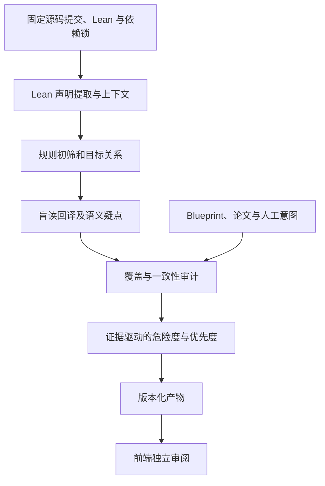

# KIP-12 回译与审阅分级管线设计

状态：设计草案，尚未实现或运行模型管线。研究日期：2026-10-03（Asia/Shanghai）。

更新：源码索引与必审集合、单声明任务与主题组任务的修订见 [REVIEW_SCOPE.md](REVIEW_SCOPE.md)。后续实施以该范围修订为准；本文件的通用数据与阶段设计继续适用。

目标：在一个增量任务流程中产生忠实于 Lean 的中文数学陈述、审阅优先度、危险度及可追溯依据，输出给现有 Statement 审阅工作台。机器产物与人的三态判断分别存储。

## 项目调研与取舍

| 项目 | 查证到的公开材料 | 借鉴点 | 使用边界 |
| --- | --- | --- | --- |
| Prove2Me | [审阅说明](https://github.com/prove2me/prove2me_workspace/blob/main/references/mission_auditor.md)、[论文](https://www.preprints.org/manuscript/202608.1796) | 盲读回译；逐项交代变量、假设、边界情况和非标准定义；与意图比较留给另一阶段 | 官方 GitHub 组织当前可见 workspace 与 formalpedia 两个仓库，未找到完整平台后端；不能据此断言整个平台开源或闭源 |
| LeanExplore | [提取流程](https://github.com/lean-explore/lean-explore/blob/main/docs/extraction-pipeline.md)、[论文](https://arxiv.org/abs/2506.11085)、[代码](https://github.com/lean-explore/lean-explore) | 结构化提取、批量生成、分阶段重跑；图的重要性指标 | Apache-2.0 代码；其自然语言描述面向搜索，不应直接视为经过审计的回译；全库 PageRank 不等于 KIP126 目标的重要性 |
| ProofNet | [代码和目录说明](https://github.com/zhangir-azerbayev/ProofNet)、[论文](https://arxiv.org/abs/2302.12433) | informalization/backtranslation 的数据与实验脚本；成对陈述可帮助评估 | 原仓库是 Lean 3，不能直接承担 Lean 4.32.2 的源码提取；本科数学评测不能替代 KIP126 的领域校准 |
| leagent / lean-extract | [项目说明](https://github.com/leanprover/leagent)、[声明闭包设计](https://github.com/leanprover/leagent/blob/main/docs/single-decl-extraction.md) | 区分 statement cone 与 proof-only cone；保留提取缺口和原始常量身份 | README 声明构建测试支持 4.32.2，但尚未在 KIP126 验证；闭包文档与实际接口需一并验收，不能只凭文档宣称可用；正式复制或依赖代码前确认授权 |

以上材料是研究输入，没有安装 Prove2Me 技能、提交任务或连接其账号。这里采用的是工作流思路，不照搬平台，也不升级 KIP126 的 Lean 工具链。

## 当前前端数据的缺口

当前 develop 固定为 `38554617a4465bbce021b88977af660b90d83697`，Lean 4.32.2，预览有 6,222 条源码声明。`statements.py` 通过源码定位和名称候选生成图，通过路径/种类规则生成 priority/risk；只有三份绑定源码的回译草稿。

例如 `sphereAdamsData := sphereAdamsModel.sequence` 的界面目前显示零个已定位引用。源码里的点字段访问并不意味着零依赖。新管线需要由 Lean 解析实际模型、投影和实例，再解释它的语义。全文正则定位继续作为源码显示与降级入口，不作为语义闭包依据。

## 一个任务流程，隔离不同阶段的输入



初筛用于安排生成任务；最终分级会吸收回译和审计发现。合并到一条管线意味着共享任务、数据、缓存和日志，不意味着把原始意图塞进同一次回译调用。

### 1. 提取

- 输入固定提交、`lean-toolchain`、`lake-manifest.json`、目标声明清单与 extractor 版本。目标清单可明确填写主定理和里程碑，文件名识别仅为备选。
- 从编译环境取完整声明类型、所有显式/隐式 binder 与 typeclass 假设、宇宙参数、定义值、源码范围、实例选择与结构投影。
- 三类关系单独记录：直接类型引用、定义实现引用、证明项引用。陈述语义闭包由类型引用出发，沿自定义定义实现继续展开；证明闭包用于追溯前提和证明状态。字段、构造器和生成声明必须能映射回原对象，不能静默丢掉。
- 给实际实例化的字段提供替换后的类型，并保留展开前后的对应关系。展开设置采用 allowlist、深度/大小上限；opaque/axiom 不能发明定义。达到上限记录 `context_incomplete`。
- 提取器构建失败、某文件无法编译或常量未定位时保留 unknown/blocked，记录具体缺口，不能把失败转换成“零依赖”。
- 第一版先做 leagent 的 4.32.2 适配试验。若接口不满足字段实例化，用薄 Lean 导出器补充；这些是选型计划，并非已验证集成。

### 2. 初筛与上下文包

声明按依赖顺序处理，互相递归的声明先折叠为组。为每个声明生成有证据 ID 的上下文包：类型、绑定变量、选定展开、自定义定义、所用实例、未解析对象。

回译包移除 Blueprint、论文、自然语言标题与源码注释/docstring，避免它们携带“应该表达什么”的意图。保留 Lean 名称用于定位，但名称不能作为语义正确的证据。依赖回译可帮助阅读，原始 Lean 类型和定义始终是事实来源。

从目标的陈述闭包、证明闭包以及自定义语义边界计算初步优先度。库级中心性只能用于同档排序，不能将 Mathlib 通用对象排在项目目标前面。

### 3. 盲读回译

输入只含 Lean 上下文包，不含原始意图或人的评审结果。输出中文正文和 LaTeX，以及：变量/量词/假设清单、定义与实例解释、边界情况、未解释部分、证据引用、可能的语义风险。

风险发现与回译可以在本次调用中一起输出，但不要求模型判定“符合原论文”。未理解的定义必须明确保留为未解释项。不可把注释或领域知识中的结论补成 Lean 中没有的条件或保证。

模型适配器支持导出 job JSONL、导入结果 JSONL，以及日后接入选定 provider。导入必须验证任务 ID、上下文指纹、输出格式和证据 ID。第一版无需绑定某家模型，也不默认对全量 6,222 条进行付费生成。

### 4. 审计

开启一个独立模型上下文或独立人工审计任务，对照类型、绑定清单、定义展开与草稿检查遗漏、增强/弱化、量词顺序、逻辑方向、范围和边界值。

此时才可接入有定位信息的 Blueprint/论文/作者意图，输出逐点差异。若不存在可靠原始意图，结果为 `no_reference`，只做内部忠实度检查。复核可以用不同模型减少共同偏差，但模型一致不能视为数学认证。

对可提出具体形式命题的虚假前提、蕴含和边界反例，可增加局部 Lean 检查；记录实际证明或反例证据。自然语言回译不能被 Lean 类型检查直接认证，重新形式化成功也不等于与原类型等价。

### 5. 危险度、证明状态与优先度

三个维度必须分开：

| 维度 | 关注的问题 | 输出 |
| --- | --- | --- |
| 语义危险度 | 陈述或解释可能在哪里偏离/误导 | R0 常规、R1 注意、R2 高危、R3 关键异常，或 unknown |
| 证明/前提状态 | 是否有 sorry、自定义公理、外部证书或尚未验证的桥接 | 结构化事实、依赖路径与核验状态，不直接给语义结论 |
| 审阅优先度 | 对当前目标，哪些对象应先交给数学审阅者 | P0 必审、P1 优先、P2 常规、P3 按需，以及具体理由 |

R0 是未发现规则或审计风险，不能显示成“已正确”。unknown 在队列中优先补证据，不能映射成低风险。暂定分级规则需要用人工样本校准：

- R3：得到明确证据的关键差异或退化，例如已经核实的不可满足前提使关键目标空真、已证实的回译漏项/方向错误、已证实的目标定义错误。
- R2：尚待复核的语义差异、缺失关键上下文、缺少解释的自定义实现、需要核验的数学对象到计算表示的桥接。候选问题注明“待核验”，不显示为已经发现错误。
- R1：量词交错、隐式参数较多、非标准实例、整数/自然数转换、总函数边界等注意信号。单凭这些语法不能判定错误。
- R0：提取和覆盖完整，未发现以上信号。仍保留回译审计与人的判断。

`sorry`、自定义 axiom、计算证书缺口分别进入 proof/assumption 状态；它们会影响审阅优先度，但不能单凭存在就断言陈述语义错误。基础公理与项目自定义假设分别展示。

优先度采用有解释的档位，先从规则计算，再按风险提升：

- P0：配置的主目标、人工指定的必审里程碑，以及已证实影响目标的 R3 条目。
- P1：主目标关键陈述定义/实例、语义解释桥接、公理/文献/计算输入边界，以及目标闭包中 R2/unknown 对象。
- P2：其余目标支持引理和一般需审对象。
- P3：闭包之外的通用基础设施；可人工提升。

目标闭包指目标实际类型、定义展开和证明中的可达依赖，证明未完成时必须标记覆盖不完整。原则上不因某对象位于 KIPBase 就自动降级；若它决定主目标的数学含义，它应进入 P1。风险通过具体目标依赖路径影响优先度，不把所有下游的自身危险度都染成高危。

排序先按 P 档，再按 unknown/危险度、目标距离、影响的项目目标数、未审/变化状态和稳定 ID。人工覆盖分级须有操作者、理由和有效版本，不修改模型或规则原始结果。

## 产物与接入

建议每条保留四份产物 `context.json`、`readback.json`、`audit.json`、`triage.json`。批次有 manifest，记录 source commit、工具链、锁文件指纹、提取器/提示词/规则/模型版本、运行状态、消耗与失败详情。

最小输出契约：

```json
{
  "schema": "statement-analysis.v1",
  "declaration_id": "statement::<raw Lean identity>",
  "source_commit": "<40hex>",
  "context_fingerprint": "<sha256>",
  "readback": {
    "status": "draft",
    "text": "<中文和 LaTeX>",
    "binder_coverage": [],
    "unresolved": [],
    "evidence_ids": []
  },
  "audit": {"coverage": "unknown", "alignment": "no_reference", "findings": []},
  "proof_status": {"sorry": "unknown", "custom_axioms": [], "external_checks": []},
  "risk": {"level": "unknown", "reasons": []},
  "priority": {"level": "P1", "reasons": [], "target_paths": []},
  "provenance": {"extractor": "<version>", "prompt": "<version>", "model": "<recorded model>", "policy": "triage.v1"}
}
```

这是契约示意，包含占位值，不能作为已经生成的真实分析。每项 finding 应附 evidence ID、源码位置、候选/已核验状态和解释，不能只存一个分数。

前端新增回译状态、回译与原始意图对照、风险依据、影响目标路径；三个状态分开展示。过滤和排序读取分析产物，缺产物继续展示现有阅读摘要。依赖图可以分别展示陈述/定义/证明关系，并标明候选还是编译提取。

机器审计不能写入人的“通过/没看懂/不通过”记录。普通审阅者继续看不到他人的判断；模型分级也不读取个人审阅记录来推断语义。管理员可以单独看机器结果与人的分歧。

## 增量、失败与缓存

- 上下文缓存键由声明类型、语义相关定义/实例闭包、工具链、依赖锁、展开策略和提取版本决定；单独更新无关证明不应重做回译。证明状态单独随证明闭包更新。
- model/prompt 变化重做生成/审计；参考意图变化只重做对照审计；目标清单/分级规则变化只重算分级。
- 依赖定义变化使所有语义受影响的下游回译失效；不能只比较该条目的源码。提交 SHA 用于溯源，不作为全量强制失效的唯一键。
- 人的评审指纹需要纳入所见的语义上下文和回译版本，变化时保留历史并标记重审；仅优先度重排不应使数学判断过期。
- 任一批次可恢复、有重试上限和预算上限；结果采用原子发布，错任务/旧指纹/未知证据 ID 拒收。部分失败不清空上一版本，但上一版本必须明确显示过期。
- 记录本次声明的证据完整度；展开或提取缺口影响的路径要保留，不能误记为完整、无异常的成功任务。

## 第一轮试运行与验收

1. 固定当前 develop 与 4.32.2，在隔离导出工具目录验证主定理及其三条直接引用，尤其确认 `sphereAdamsData → sphereAdamsModel → sequence` 实际语义关系。
2. 挑选 30–50 条校准集，覆盖最终目标、Structure 实例、自定义非计算定义、解码/计算桥接、项目假设、KIPBase 基础对象及普通引理。先人工做 binder/前提/含义基准，再比较生成结果。
3. 生成盲读草稿、独立复核和分级，导入现有工作台；确认失败和 unknown 的显示，不冒充完整语义回译。
4. 在人工确认后扩到目标闭包，再逐批覆盖全部条目，按每类条目抽检。

验收重点：隐式前提和量词覆盖、字段实例化可追溯、上下文缺口明确、目标关系和危险度可解释、没有意图泄漏、关键定义变化后下游失效、机器结果与人工记录隔离。

回归集加入量词互换、删除假设、`<`/`≤`、`∃`/`∃!`、蕴含/等价、Nat/Int、空集/零值、自定义实例替换等变异。变异不一定改变语义：每个样本必须先人工或 Lean 核验，避免把合法等价变形计成错误。记录真实漏报和误报，不先承诺未经测量的准确率。

本轮产出是设计、提示词及规则配置草案，没有生成新的全量回译，也没有修改当前预览的数学数据。
